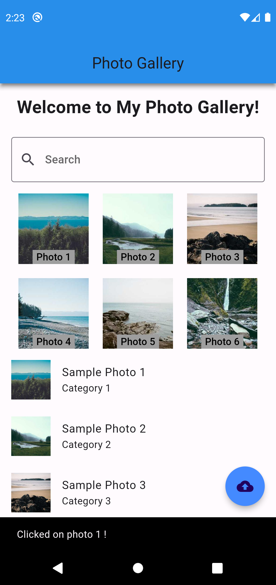
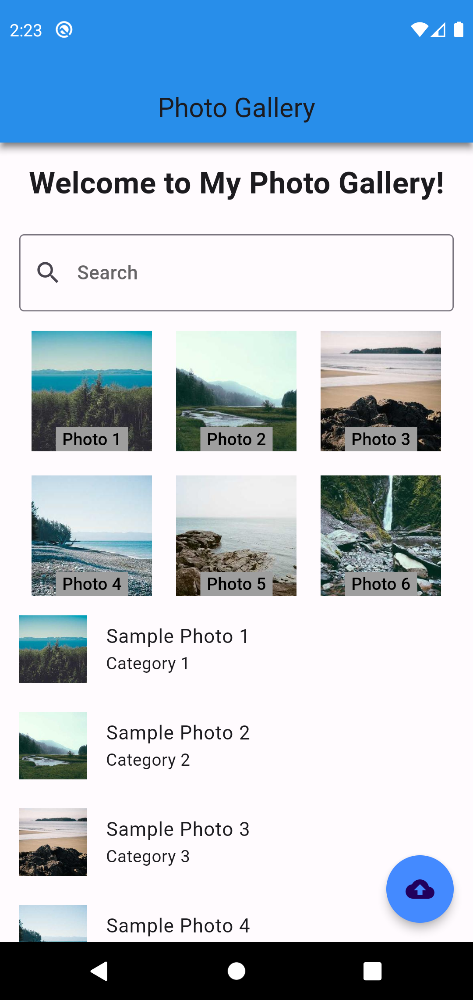

# ostad_flutter_assignment_2

● Implement an AppBar at the top with a title "Photo Gallery". ● Inside the body of the Scaffold, create a SingleChildScrollView to enable scrolling. ● Within the SingleChildScrollView, create a Column widget. ● Inside the Column widget, add a Container to display a welcome message such as "Welcome to My Photo Gallery!". ● Below the welcome message, create a TextField for users to search for specific photos. Use appropriate styling and placeholder text. No search functionality needed just design the TextField. ● Implement a Wrap widget to display a grid of photos. ● The images must be Network Images. You can choose any network image as you like. There must be at least 6 images in the Wrap Widget. ● Each photo should be represented by an ElevatedButton or OutlineButton with an Image and caption below it. ● While clicking on each image there should be a Snackbar Showing message “Clicked on photo!”. ● Add appropriate spacing and styling to the buttons, images, and captions. ● Use a ListView to display a list of ListTile widgets below the photo grid. ● Each ListTile should represent a photo with a title and a subtitle. Add at least three sample photos to the list. ● Implement a button, such as an IconButton, that when pressed, displays a SnackBar with the message "Photos Uploaded Successfully!".

      
   
